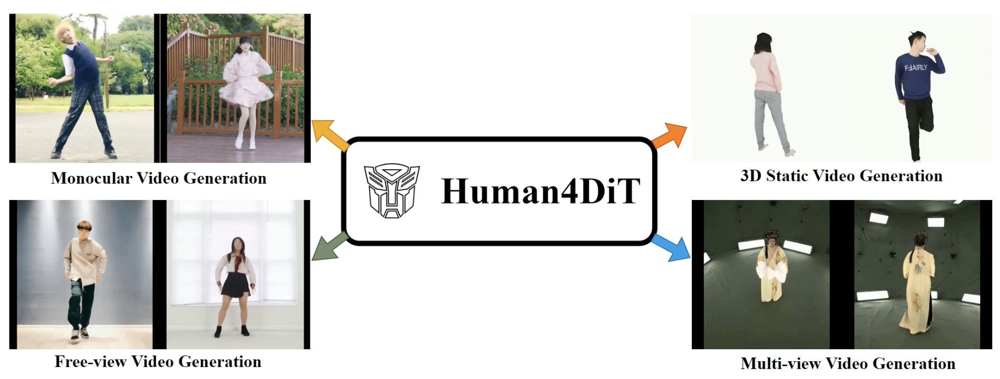

# [Human4DiT: 360-degree Human Video Generation with 4D Diffusion Transformer (SIGGRAPH ASIA 2024 Journal Track)](https://human4dit.github.io)
[Ruizhi Shao*](https://dsaurus.github.io/saurus/), [Youxin Pang*](), [Zerong Zheng](http://zhengzerong.github.io/), [Jingxiang Sun](https://mrtornado24.github.io), [Yebin Liu](http://www.liuyebin.com/).

[](https://arxiv.org/abs/2405.17405)

This repository contains the official implementation of ”*Human4DiT: 360-degree Human Video Generation with 4D Diffusion Transformer*“.



### News
* **[2024/10/21]** Human4DiT processing code is available!
* **[2024/10/08]** Human4DiT dataset is available!


### TODO
- [x] Human4DiT dataset
- [x] Human4DiT dataset preprocssing code
- [ ] Human4DiT model and inference code
- [ ] Human4DiT training code

## Human4DiT Dataset

### Dataset Structure
**Human4DiT dataset** consists of 10K monocular human videos from the internet, 5k 3D human scans captured by a dense DLSR rig and 100 4D human characters. 

For monocular human videos, we provide their downlond urls and corresponding SMPL sequences. For human scans, we provide 3D models (obj file) and the estimated SMPL model. For 4D human characters, we provide FBX model files.

### Agreement
1. The Human4DiT dataset (the "Dataset") is available for **non-commercial** research purposes only. Any other use, in particular any use for commercial purposes, is prohibited. This includes, without limitation, incorporation in a commercial product, use in a commercial service, as training data for a commercial product, for commercial ergonomic analysis (e.g. product design, architectural design, etc.), or production of other artifacts for commercial purposes including, for example, web services, movies, television programs, mobile applications, or video games. The dataset may not be used for pornographic purposes or to generate pornographic material whether commercial or not. The Dataset may not be reproduced, modified and/or made available in any form to any third party without Tsinghua University’s prior written permission.

2. You agree **not to** reproduce, modified, duplicate, copy, sell, trade, resell or exploit any portion of the images and any portion of derived data in any form to any third party without Tsinghua University’s prior written permission.

3. You agree **not to** further copy, publish or distribute any portion of the Dataset. Except, for internal use at a single site within the same organization it is allowed to make copies of the dataset.

4. Tsinghua University reserves the right to terminate your access to the Dataset at any time.

### Download Instructions 
The dataset is encrypted to prevent unauthorized access.

Please fill the [request form](https://docs.google.com/forms/d/e/1FAIpQLScMfdqBL3e1fLfka3THCo2Kmuf6Wzv0q-iFMshao3D3u6ZFHQ/viewform?usp=sf_link) and get the download links of Human4DiT dataset.

By requesting for the link, you acknowledge that you have read the agreement, understand it, and agree to be bound by them. If you do not agree with these terms and conditions, you must not download and/or use the Dataset.

## Dataset Processing

The code for processing dataset in the ```data_scripts``` folder.

### Download Videos from Internet

First download the csv file of ```Human4DiT-Video```. Then install [yt-dlp](https://github.com/yt-dlp/yt-dlp), which is a tool to download videos. You can download all videos using the following command:
```
python download.py --csv-file HUMAN4DIT_VIDEO_CSV --yt-dlp-path YT_DLP_PATH --output-dir OUTPUT_PATH --cookies COOKIES_PATH --download-nums DOWNLOAD_NUMS
```

For cookies, you should open your browser and sign in [BiliBili]("https://www.bilibili.com/) to get BiliBili cookie. If you don't have cookies, you can still download videos. However, the resolution will be limited in 720P.

### Cut Videos

We use ```ffmpeg+NVENC``` (CUDA) to cut videos, which is much more efficient than CPU. If you only has CPU, you should open ```video_cut.py``` and change ```hevc_nvenc``` in line 124 to other CPU-only encoders. Once you finished downloading videos, you can run the following code to cut videos.

```
python video_cut.py --csv-file HUMAN4DIT_VIDEO_CSV --num-devices YOUR_GPU_NUMS --process-nums MULTIPROCESSING_NUMS --input-video-dir VIDEO_DOWNLOAD_DIR --output-video-dir CUT_VIDEO_FOLDER
```

### Render SMPL Normals from SMPL Sequences

To render SMPL normals, you should first install [SMPLX](https://github.com/vchoutas/smplx/tree/main) and download the SMPL model file ```basicModel_neutral_lbs_10_207_0_v1.0.0.pkl```. You need also install [Pytorch3D](https://github.com/facebookresearch/pytorch3d) which can render SMPL normal maps with GPU. Finally you can download all SMPL sequnece files into SMPL_FOLDER and use the following code to render SMPL normal videos.

```
python render_smpl.py --num-devices GPU_NUMS --process-nums MULTIPROCESSING_NUMS --video-dir CUT_VIDEO_FOLDER --smpl-dir SMPL_FOLDER --output-dir RENDER_RESULTS_PATH --smpl-model-path PATH_TO_basicModel_neutral_lbs_10_207_0_v1.0.0.pkl
```

## Citation
```
@article{shao2024human4dit,
title={Human4DiT: 360-degree Human Video Generation with 4D Diffusion Transformer},
author={Shao, Ruizhi and Pang, Youxin and Zheng, Zerong and Sun, Jingxiang and Liu, Yebin},
journal={ACM Transactions on Graphics (TOG)},
volume={43},
number={6},
articleno={},
year={2024}, publisher={ACM New York, NY, USA}
}
```